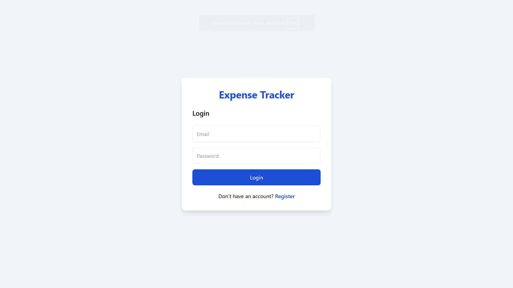
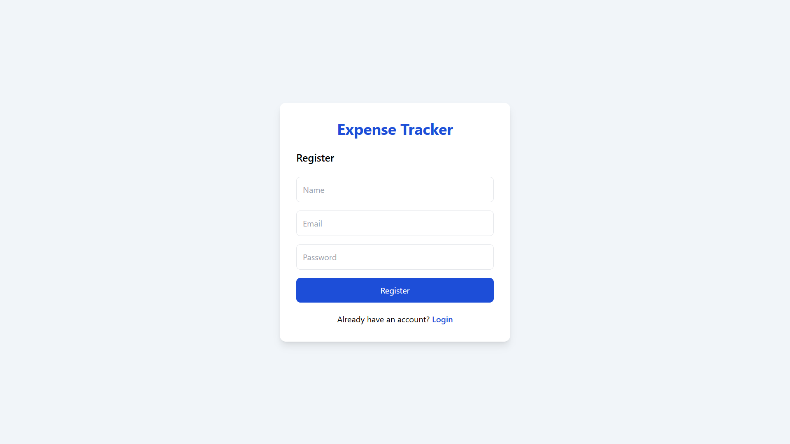
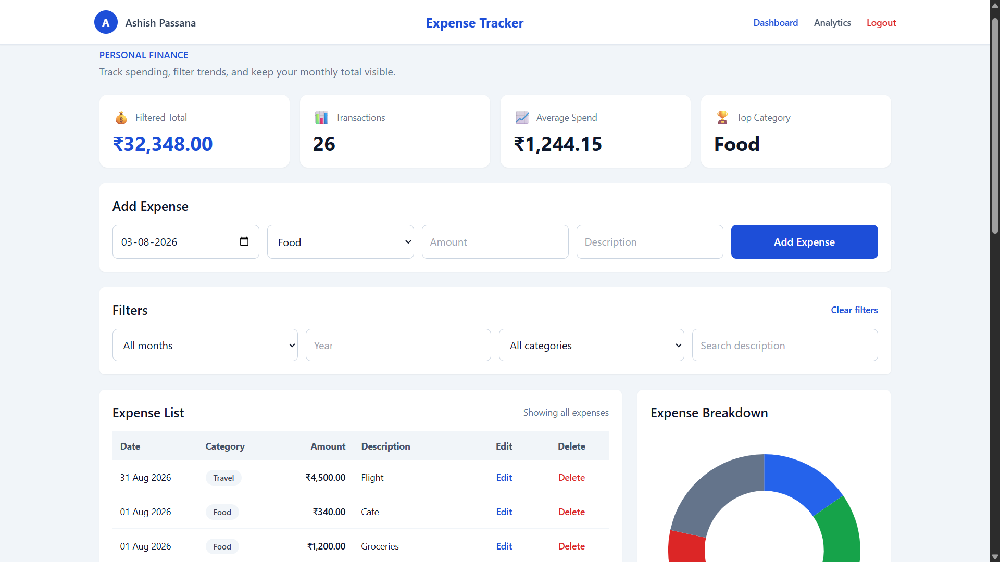
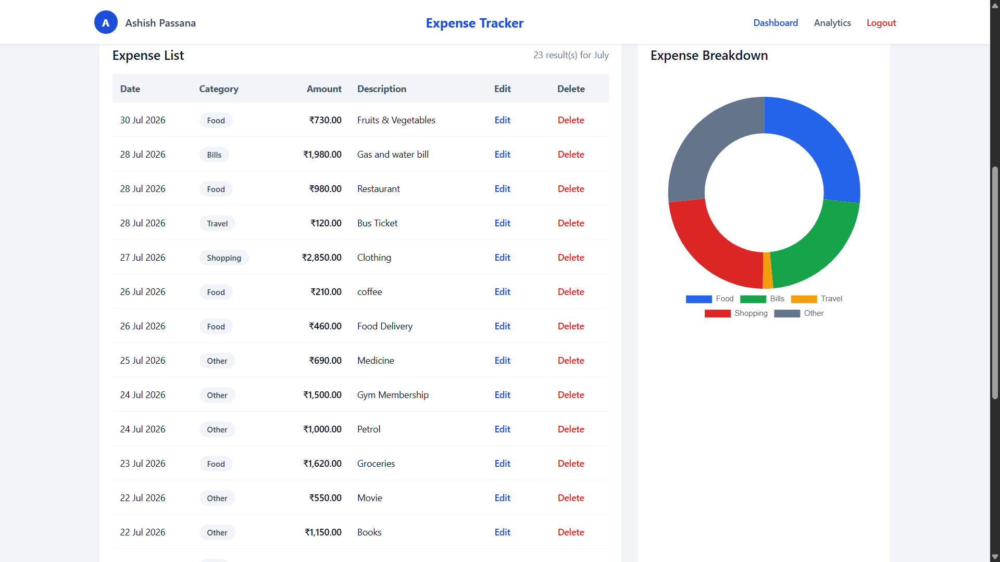
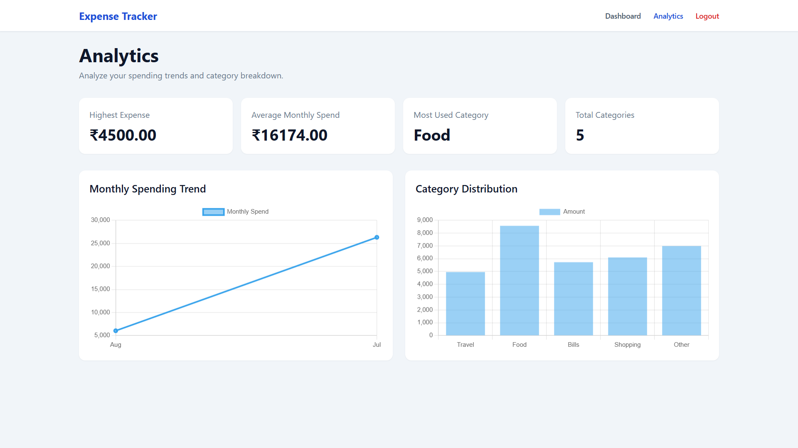
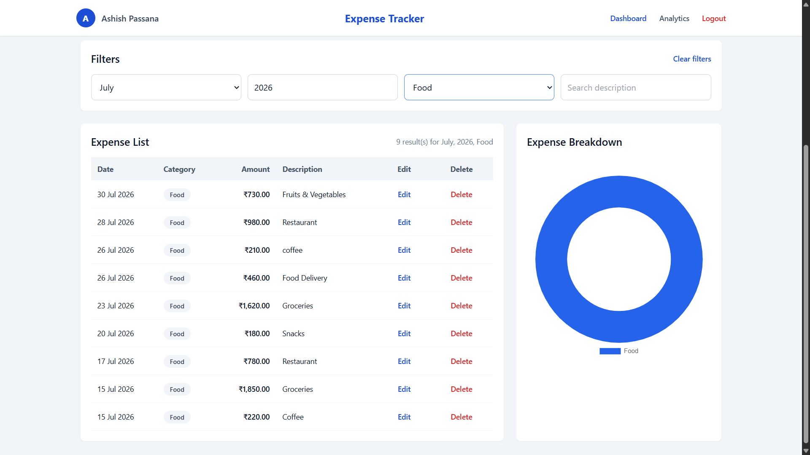

# 💰 Expense Tracker  | Full-Stack Web Application


A production-ready full-stack Expense Tracker that enables users to securely manage daily expenses through JWT authentication, visualize spending patterns with interactive charts, and store data in MongoDB Atlas. The application is fully deployed using Vercel and Render, providing a seamless cloud-based experience.

## Live Demo

 **Frontend**
🔗 https://expense-tracker-full-stack-zeta.vercel.app

 **Backend API**
🔗 https://expensetrackerfullstack-8fkb.onrender.com

---

## Features

- Secure user authentication using JWT
- User Registration & Login
- Create, update, and delete expenses
- Filter Expenses by Month & Year
- Interactive Expense Analytics using Chart.js
- MongoDB Atlas Cloud Database
- Responsive User Interface
- Deployed using Vercel & Render

---

## 🛠️ Tech Stack

|      Category       |            Technologies               |
|---------------------|---------------------------------------|
|    **Frontend**     | HTML5, CSS3, Tailwind CSS, JavaScript |
|    **Backend**      |        Node.js, Express.js            |
|    **Database**     |       MongoDB Atlas, Mongoose         |
| **Authentication**  |             JWT, bcrypt               |
|    **Charts**       |              Chart.js                 |
|   **Deployment**    |           Vercel, Render              |
| **Version Control** |             Git, GitHub               |

---

## Application Screenshots

### Authentication

| Login | Register |
|-------|----------|
|  |  |

---

### Dashboard

| Overview | Expense Table |
|----------|---------------|
|  |  |

---

###  Analytics & Filtering

| Expense Analytics | Filter Expenses |
|-------------------|-----------------|
|  |  |


---

## 🏗️ Project Architecture

```text
                   User
                     │
                     ▼
       Frontend (HTML, CSS, JavaScript)
                     │
              Fetch API Requests
                     │
                     ▼
        Node.js + Express REST API
                     │
          JWT Authentication Middleware
                     │
                     ▼
         MongoDB Atlas (Mongoose)
```

---


## 📂 Project Structure

```text
ExpenseTrackerFullStack
│
├── 📁 assets
│   ├── analytics.png
│   ├── dashboard-overview.png
│   ├── dashboard-table.png
│   ├── filter.png
│   ├── login.png
│   └── register.png
│
├── 📁 backend
│   ├── 📁 config
│   │   └── db.js
│   ├── 📁 controllers
│   │   ├── authController.js
│   │   └── expenseController.js
│   ├── 📁 middleware
│   │   └── authMiddleware.js
│   ├── 📁 models
│   │   ├── expense.js
│   │   └── user.js
│   ├── 📁 routes
│   │   ├── authRoutes.js
│   │   └── expenseRoutes.js
│   ├── server.js
│   ├── package.json
│   ├── package-lock.json
│   └── .env
│
├── 📁 frontend
│   ├── 📁 js
│   │   ├── analytics.js
│   │   ├── api.js
│   │   ├── auth.js
│   │   ├── login.js
│   │   ├── register.js
│   │   └── script.js
│   ├── analytics.html
│   ├── index.html
│   ├── login.html
│   └── register.html
│
├── .gitignore
└── README.md
```

---

##  Installation

### 1. Clone the Repository

```bash
git clone https://github.com/ashishpassana/ExpenseTrackerFullStack.git
cd ExpenseTrackerFullStack
```

### 2. Install Backend Dependencies

```bash
cd backend
npm install
```

### 3. Configure Environment Variables

Create a `.env` file inside the **backend** folder.

```env
MONGO_URI=your_mongodb_connection_string
JWT_SECRET=your_jwt_secret
PORT=5000
```

### 4. Start the Backend Server

```bash
npm start
```

### 5. Run the Frontend

Open `frontend/index.html` using **Live Server** or any static web server.

---

##  Environment Variables

| Variable | Description |
|----------|-------------|
| `MONGO_URI` | MongoDB Atlas connection string |
| `JWT_SECRET` | Secret key used for JWT authentication |
| `PORT` | Backend server port |

---

##  API Endpoints

### Authentication

| Method | Endpoint | Description |
|---------|----------|-------------|
| POST | `/auth/register` | Register a new user |
| POST | `/auth/login` | Authenticate user |

### Expenses

| Method | Endpoint | Description |
|---------|----------|-------------|
| GET | `/expenses` | Retrieve all expenses |
| POST | `/expenses` | Create a new expense |
| PUT | `/expenses/:id` | Update an existing expense |
| DELETE | `/expenses/:id` | Delete an expense |

---

## 🚀 Deployment

The application is fully deployed on cloud platforms.

| Service | Platform |
|----------|----------|
| Frontend | Vercel |
| Backend | Render |
| Database | MongoDB Atlas |

### Live Application

**Frontend**

https://expense-tracker-full-stack-zeta.vercel.app

**Backend API**

https://expensetrackerfullstack-8fkb.onrender.com

---

## 🔮 Future Improvements

- Export expenses to PDF or Excel
- Monthly budget planning
- Dark mode support
- Email verification
- Forgot password functionality
- Expense categories with icons
- Recurring expenses
- Dashboard statistics with multiple chart types

---

## 👨‍💻 Author

**Ashish Passana**

- GitHub: https://github.com/ashishpassana
- LinkedIn: [www.linkedin.com/in/ashish-passana](https://www.linkedin.com/in/ashish-passana/)